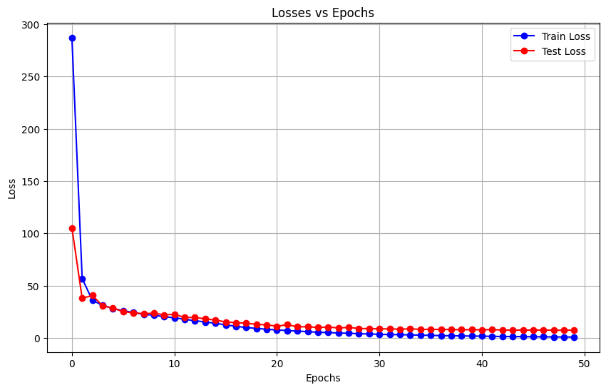

# Circle Detection ML Challenge:: 

## **Goal**

The objective of the Circle Detection ML Challenge is to design a robust circle detector capable of accurately locating circles in images with varying levels of noise. The challenge involves developing a deep learning model that takes an image as input and outputs the circle's center coordinates (x, y) and its radius.

## **Project Overview**

### Task:

Develop a deep-learning model to detect circles in images. The model should be trained to handle noisy images and provide precise estimates of the circle's parameters.

#### _Input_  
Input images with varying levels of noise.

#### _Output_  
Predicted location of the circle's center (x, y).\
The predicted radius of the detected circle.

### Dataset

I've generated a custom dataset with the following characteristics:\
Size: 20,000 images (tried on smaller dataset, but did not get good results)\
Train-Test Split: 80% for training, 20% for testing\
Noise Levels: Varied from 0.1 to 0.5 to simulate real-world scenarios.\

#### Data Generation

I've implemented the data generation process in prepare_data.py, which includes functionality for creating samples with varying noise parameters and splitting the dataset into training and testing sets.

Image Characteristics\
Color Space: Grayscale (1 channel) for simplicity in model architecture.\
Noise Parameters: Varied to ensure the model's adaptability to different noise levels.

### Model

#### Model Architecture
**Convolutional Blocks**

`Block 1:`\
Convolution Layer 1: Input channels (1 for grayscale), output channels (64), kernel size (3x3), padding (1), stride (1)\
ReLU Activation\
Convolution Layer 2: Input channels (64), output channels (128), kernel size (3x3), padding (1), stride (1)\
ReLU Activation\
MaxPooling Layer: Kernel size (2x2)

`Block 2`:\
Convolution Layer 3: Input channels (128), output channels (256), kernel size (3x3), padding (1), stride (1)\
ReLU Activation\
MaxPooling Layer: Kernel size (2x2)

`Output Layer`:\
Flatten Layer: Flattens the output from the convolutional layers.\
Two Fully Connected layers, with ReLU activation, the final layer outputs 3 features

#### Model Parameters

Input Shape: Grayscale images with a single channel (1).\
Hidden Units: 64 (Adjustable parameter for the number of neurons in the hidden layers).\
Output Shape: 3 (Representing (x, y, radius) of the circle).\
Image Size: 100x100 pixels

## Project Structure

- `results:` This directory has the outcomes of model runs with a noise level set to 0.1, 0.2, and 0.3.

- `model.py:` Defines the architecture of the Convolutional Neural Network (CNN) model designed for circle detection.

- `prepare_data.py:` This module contains functions responsible for generating and preprocessing the dataset. It involves creating synthetic images of circles with varying noise levels.

- `run.py:` This script has the entire pipeline, from data generation to model training. It acts as a helper file.

- `train.py:` Contains functions relevant to the training process of the circle detection model.

- `utils.py:` This module has utility functions used throughout the project.

## Running the Project

To run the complete pipeline, execute `run.py`. 

## Results

For noise level 1, I have used the following configurations:
1. Dataset containing 20,000 images (80/20 split)
2. Adam Optimizer with a learning rate of 0.01
3. 50 Epochs (was getting good performance with a lesser number of epochs

Obtained MSE Loss in the range of 0.52 for training data, and test accuracy as 97%. (used IoC score and threshold of 0.7 to get accuracy)
